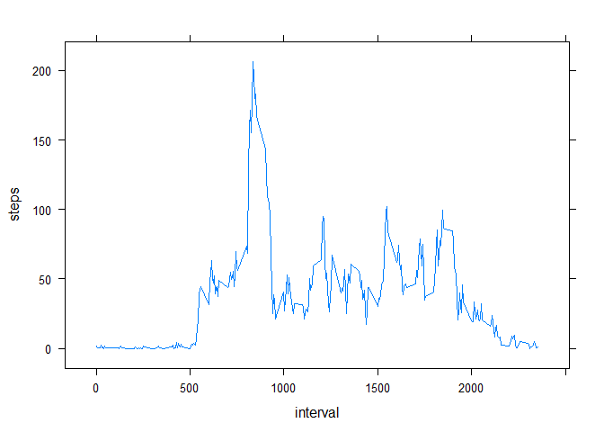

# Reproducible Research: Peer Assessment 1

## Loading and preprocessing the data

```r
activity_data <- read.csv(unz("activity.zip", "activity.csv"), header=TRUE)
```

## What is mean total number of steps taken per day?
1. Calculate the total number of steps taken per day

```r
steps_per_day = aggregate(x=list(Steps = activity_data$steps), by=list(Date = activity_data$date), sum)
steps_per_day
```

```
##          Date Steps
## 1  2012-10-01    NA
## 2  2012-10-02   126
## 3  2012-10-03 11352
## 4  2012-10-04 12116
## 5  2012-10-05 13294
## 6  2012-10-06 15420
## 7  2012-10-07 11015
## 8  2012-10-08    NA
## 9  2012-10-09 12811
## 10 2012-10-10  9900
## 11 2012-10-11 10304
## 12 2012-10-12 17382
## 13 2012-10-13 12426
## 14 2012-10-14 15098
## 15 2012-10-15 10139
## 16 2012-10-16 15084
## 17 2012-10-17 13452
## 18 2012-10-18 10056
## 19 2012-10-19 11829
## 20 2012-10-20 10395
## 21 2012-10-21  8821
## 22 2012-10-22 13460
## 23 2012-10-23  8918
## 24 2012-10-24  8355
## 25 2012-10-25  2492
## 26 2012-10-26  6778
## 27 2012-10-27 10119
## 28 2012-10-28 11458
## 29 2012-10-29  5018
## 30 2012-10-30  9819
## 31 2012-10-31 15414
## 32 2012-11-01    NA
## 33 2012-11-02 10600
## 34 2012-11-03 10571
## 35 2012-11-04    NA
## 36 2012-11-05 10439
## 37 2012-11-06  8334
## 38 2012-11-07 12883
## 39 2012-11-08  3219
## 40 2012-11-09    NA
## 41 2012-11-10    NA
## 42 2012-11-11 12608
## 43 2012-11-12 10765
## 44 2012-11-13  7336
## 45 2012-11-14    NA
## 46 2012-11-15    41
## 47 2012-11-16  5441
## 48 2012-11-17 14339
## 49 2012-11-18 15110
## 50 2012-11-19  8841
## 51 2012-11-20  4472
## 52 2012-11-21 12787
## 53 2012-11-22 20427
## 54 2012-11-23 21194
## 55 2012-11-24 14478
## 56 2012-11-25 11834
## 57 2012-11-26 11162
## 58 2012-11-27 13646
## 59 2012-11-28 10183
## 60 2012-11-29  7047
## 61 2012-11-30    NA
```

2. If you do not understand the difference between a histogram and a barplot, research the difference between them. Make a histogram of the total number of steps taken each day

```r
hist(steps_per_day$Steps, breaks=50, main="Histogram of steps per Day", xlab="Steps per Day")
```

<!-- -->

3. Calculate and report the mean and median of the total number of steps taken per day

```r
mean(steps_per_day$Steps, na.rm=TRUE)
```

```
## [1] 10766.19
```

```r
median(steps_per_day$Steps, na.rm=TRUE)
```

```
## [1] 10765
```

## What is the average daily activity pattern?

load lattice package, aggregate the steps data per interval and plot the average number of steps in a timeseries over the intervals

```r
library("lattice")
ts_data = aggregate(x=list(steps = activity_data$steps), by=list(interval = activity_data$interval), mean, na.rm=TRUE)
xyplot(steps ~ interval, data=ts_data, type="l")
```

<!-- -->

Interval with the maximum steps average per day

```r
ts_data[ts_data$steps == max(ts_data$steps),]$interval
```

```
## [1] 835
```

## Imputing missing values
1. Calculate and report the total number of missing values in the dataset (i.e. the total number of rows with NAs)

```r
sum(is.na(activity_data$steps))
```

```
## [1] 2304
```
2. Devise a strategy for filling in all of the missing values in the dataset. The strategy does not need to be sophisticated. For example, you could use the mean/median for that day, or the mean for that 5-minute interval, etc.
The strategy I choose is to use the overall mean to replace the missing values. Of course there are much better and more sophisticated methods.

3. Create a new dataset that is equal to the original dataset but with the missing data filled in.

```r
activity_data_imputed <- activity_data
activity_data_imputed[is.na(activity_data_imputed$steps),"steps"] <- mean(activity_data$steps, na.rm=TRUE)
```
4. Make a histogram of the total number of steps taken each day and Calculate and report the mean and median total number of steps taken per day. 

```r
steps_per_day_imputed = aggregate(x=list(Steps = activity_data_imputed$steps), by=list(Date = activity_data_imputed$date), sum)
hist(steps_per_day_imputed$Steps, breaks=50, main="Histogram of steps per Day", xlab="Steps per Day")
```

<!-- -->

Do these values differ from the estimates from the first part of the assignment? What is the impact of imputing missing data on the estimates of the total daily number of steps?
Yes the histogram and the median values differ. Imputing causes another bias in the data, depending on the way of imputing. The way of imputing and the way of comparing can be the same, which could lead to no visible difference

```r
mean(steps_per_day_imputed$Steps)
```

```
## [1] 10766.19
```

```r
median(steps_per_day_imputed$Steps)
```

```
## [1] 10766.19
```


## Are there differences in activity patterns between weekdays and weekends?
1. Create a new factor variable in the dataset with two levels - "weekday" and "weekend" indicating whether a given date is a weekday or weekend day.

```r
activity_data_week = activity_data
activity_data_week$date <-  as.POSIXct(activity_data_week$date)

activity_data_week$weekday = as.factor(sapply(weekdays(activity_data_week$date), function(x) {if (x %in% c("Saturday","Sunday")) "weekend" else "weekday" }))
```

2. Make a panel plot containing a time series plot (i.e. type = "l") of the 5-minute interval (x-axis) and the average number of steps taken, averaged across all weekday days or weekend days (y-axis). See the README file in the GitHub repository to see an example of what this plot should look like using simulated data.


```r
library("lattice")
ts_data_week = aggregate(x=list(steps = activity_data_week$steps), by=list(interval = activity_data_week$interval, weekday = activity_data_week$weekday), mean, na.rm=TRUE)

xyplot(steps ~ interval | weekday, data=ts_data_week, type="l" ,layout = c(1,2))
```

<!-- -->
